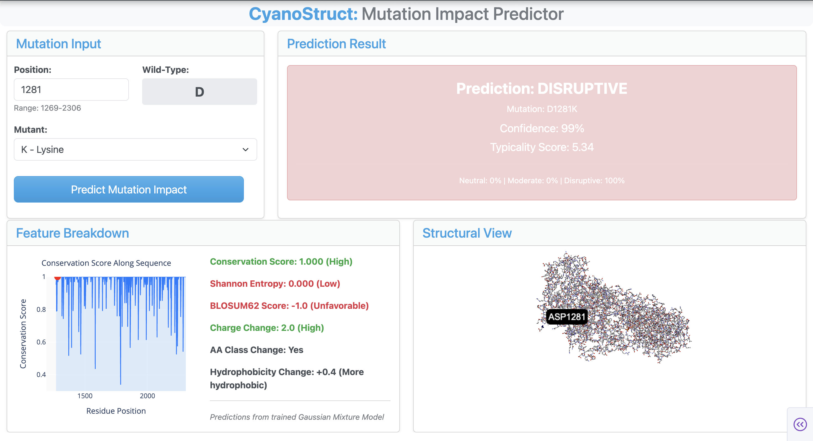

# CyanoStruct 🧬
### A Structural Bioinformatics Dashboard for Predicting Cyanobacteria Toxin Mutation Impact

---

## Overview

Harmful cyanobacterial blooms are an increasing environmental and public health concern in freshwater ecosystems, including urban creeks in Austin. Many cyanobacteria produce **microcystins (MCs)**, toxic compounds that can contaminate water and harm both humans and wildlife. Environmental variables such as nutrient levels, temperature, and pH have shown little correlation with toxin presence, motivating a deeper look at the underlying molecular mechanisms.

CyanoStruct focuses on the **mcyA gene**, a major component of the microcystin synthetase (*mcyABC*) gene cluster responsible for toxin biosynthesis. Using sequence analysis and machine learning, CyanoStruct predicts how amino acid mutations in this gene may affect protein function and toxin production.



## Features

- **Sequence conservation viewer** — visualize conservation scores along the aligned *mcyA* sequence
- **Mutation impact predictor** — input any hypothetical amino acid substitution and receive a Neutral / Moderate / Disruptive prediction with confidence score
- **3D structural viewer** — explore the 8JBR protein structure with residue-level highlighting at selected positions
- **Feature breakdown** — inspect BLOSUM62 score, charge change, hydrophobicity shift, and amino acid class change for any mutation


## Data

| Source | Description |
|--------|-------------|
| NCBI Protein Database | 63 cyanobacterial mcyA sequences (≥700 amino acids) in FASTA format |
| Protein Data Bank (PDB) | Structure 8JBR — mcyA protein with residue-level 3D annotations |


## Methods

### Pipeline (`src/main.py`)

```
seq_retrieval.py     →  Fetch mcyA sequences from NCBI
seq_alignment.py     →  Multiple sequence alignment via MAFFT
seq_calcs.py         →  Calculate conservation scores and Shannon entropy
structural_mapping.py→  Map alignment positions to PDB residue numbers
train_gmm.py         →  Train Gaussian Mixture Model and save models
```

### Machine Learning Model

A **Gaussian Mixture Model (GMM)** with full covariance was used to cluster mutations into three impact categories. GMM was chosen as an unsupervised approach because labelled mutation impact data was not available. The model takes six features as input:

| Feature | Description |
|---------|-------------|
| `conservation_score` | How conserved the position is across strains |
| `shannon_entropy` | Sequence variability at the position |
| `blosum_score` | BLOSUM62 substitution score for the mutation |
| `charge_change` | Absolute change in amino acid charge |
| `hydrophobicity_change` | Absolute change in Kyte-Doolittle hydrophobicity |
| `class_change` | Whether the amino acid class changes (polar, nonpolar, etc.) |

Clusters are labelled by ranking mean BLOSUM score — the cluster with the lowest score (most penalised substitutions) is assigned **Disruptive**, and the highest is assigned **Neutral**.


## Tech Stack

| Tool | Purpose |
|------|---------|
| [Biopython](https://biopython.org/) | Sequence retrieval, alignment parsing, BLOSUM matrix |
| [scikit-learn](https://scikit-learn.org/) | Gaussian Mixture Model, StandardScaler |
| [Dash](https://dash.plotly.com/) + Plotly | Interactive dashboard and visualizations |
| [dash-bio](https://dash.plotly.com/dash-bio) | 3D molecular structure viewer |
| [MAFFT](https://mafft.cbrc.jp/) | Multiple sequence alignment |
| [Docker](https://www.docker.com/) | Containerized deployment |


## Installation

### 1. Clone the repository
```bash
git clone https://github.com/kitkat110/cyano-struct.git
cd cyano-struct
```

### 2. Build and run with Docker
```bash
docker build -t cyano-struct .
docker run -v $(pwd)/data:/code/data cyano-struct
```

### 3. Or run locally
```bash
pip install -r requirements.txt
```


## Usage

### Step 1 — Run the data pipeline
This fetches sequences, runs alignment, calculates conservation scores, maps to PDB structure, and trains the GMM:
```bash
python src/main.py
```

Optional: set log level for more detail:
```bash
python src/main.py --loglevel INFO
```

### Step 2 — Launch the dashboard
```bash
python app.py
```

Then open [http://localhost:8050](http://localhost:8050) in your browser.

### Example
A user selects position **1281 (wild-type: Aspartic Acid / ASP)** and chooses **Lysine (K)** as the mutant. CyanoStruct extracts the relevant biochemical features for the D→K substitution and returns a prediction of **DISRUPTIVE** with 99% confidence, driven by a charge change of 2.0 and an unfavorable BLOSUM62 score.

## Directory Structure

```
cyano-struct/
├── data/                          # Sequence and conservation data
│   └── mapped_scores.csv
├── models/                        # Trained model files
│   ├── gmm.pkl
│   ├── scaler.pkl
│   ├── aa_properties.pkl
│   └── cluster_names.pkl
├── src/                           # Data pipeline scripts
│   ├── main.py
│   ├── seq_retrieval.py
│   ├── seq_alignment.py
│   ├── seq_calcs.py
│   ├── structural_mapping.py
│   └── train_gmm.py
├── app.py                         # Dash dashboard
├── Dockerfile
├── requirements.txt
└── README.md
```


## References
- NCBI Protein Database: https://www.ncbi.nlm.nih.gov/protein/
- RCSB Protein Data Bank (8JBR): https://www.rcsb.org/structure/8JBR
- MAFFT alignment tool: https://mafft.cbrc.jp/alignment/software/
- Biopython: https://biopython.org/